 

 

  

 

## ◈ What I Build

**Local-first diagnostics · Performance telemetry · Android tooling · Open-source desktop apps**

I build practical tools that expose useful system data through clean interfaces,
native components and transparent telemetry.

 

## ◈ Technology Matrix

### Primary Languages

### Application & Native Development

### Platforms & Delivery

### Data & Developer Tools

 

## ◈ Featured Projects

<table>
<tr>
<td width="50%" valign="top">

</td>
<td width="50%" valign="top">

</td>
</tr>
<tr>
<td width="50%" valign="top">

</td>
<td width="50%" valign="top">

</td>
</tr>
</table>

 

## ◈ GitHub Command Center

  

  

 

  

