 

 

  

 

## ◈ Technology Matrix

### Languages

### Frameworks & Runtime

### Infrastructure & Data

### Developer Tools

 

## ◈ GitHub Command Center

  

  

 

## ◈ Featured Project

 

## ◈ Achievements

 

  

