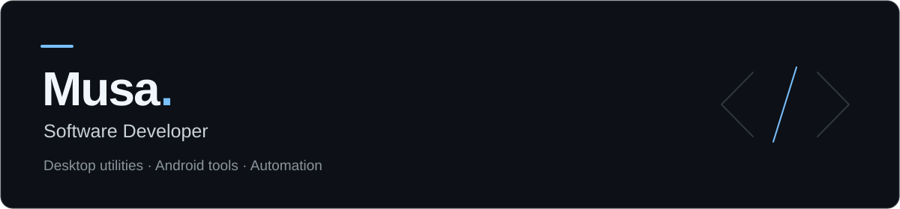

I build tools that make systems easier to inspect, understand and work with.
My projects focus on Windows desktop utilities and Android performance monitoring, with **Flutter** interfaces and **Rust** cores.

[Explore my repositories →](https://github.com/googIeuser?tab=repositories)

## Selected projects

| Project | What it does | Stack |
| :--- | :--- | :--- |
| [**NETWatcher**](https://github.com/googIeuser/NETWatcher) | Windows connection monitoring: latency, jitter and packet loss. | Flutter · Rust |
| [**USBWatcher**](https://github.com/googIeuser/USBWatcher) | Inspects USB devices, negotiated speeds, identifiers and port paths on Windows. | Flutter · Rust |
| [**FPSWatcher**](https://github.com/googIeuser/FPSWatcher) | Android game telemetry and performance profiling. | Flutter · Rust |

## Technologies

**Core stack**

**Also work with** · Java, Swift, C, C++, JavaScript, Shell, HTML, CSS, React and Node.js.

**Tools & data** · Git, Docker, Firebase, SQLite, PostgreSQL, Android Studio, Xcode, VS Code, Figma and Postman.

  
Contribution activity

   
  <picture>
    <source media="(prefers-color-scheme: dark)" srcset="https://raw.githubusercontent.com/googIeuser/googIeuser/output/github-snake-dark.svg" />
    <source media="(prefers-color-scheme: light)" srcset="https://raw.githubusercontent.com/googIeuser/googIeuser/output/github-snake.svg" />
    
  </picture>

